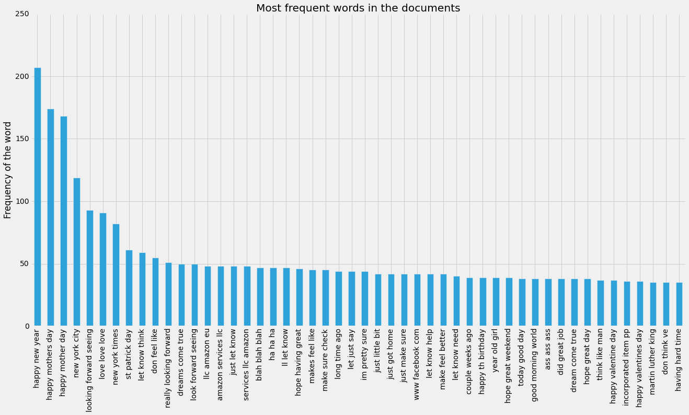

### Milestone report- Coursera Data Science Specialization Capstone Project

This milestone report summarizes my initial efforts in building a Swiftkey like prediction application. The main focus of this report is to load the data, and do some basic exploratory data analysis. In the coming weeks, when building the real application, I would like to put more effort in cleaning and preprocessing the data.

The main hurdle in this project comes from the data itself, it is uncleaned text. Natural language processing in R is unintutive, I switched to Python for this project. Python has state of the art NLP tools, and it's very easy to use. In the future, I would like do the preprocessing in Python and use R to build the actual application using Shiny utilizing the best of the both worlds!

Let's load some libraries.


```python
import numpy as np
import sklearn
import matplotlib.pyplot as plt
%pylab inline
pylab.rcParams['figure.figsize'] = (20, 10)
plt.style.use('fivethirtyeight')
import pandas as pd
from sklearn.feature_extraction.text import TfidfVectorizer, CountVectorizer
```

    Populating the interactive namespace from numpy and matplotlib
    

### Reading the files

We have three files named blogs, news and tweets. 

Let's see how many lines we have here in each file.


```python
num_lines = sum(1 for line in open('en_US/en_US.blogs.txt'))
print num_lines
```

    899288
    


```python
num_lines = sum(1 for line in open('en_US/en_US.news.txt'))
print num_lines
```

    77259
    


```python
num_lines = sum(1 for line in open('en_US/en_US.twitter.txt'))
print num_lines
```

    2360148
    

We will be generating n-grams for building our application, but generating n-grams for all the data is memory exhaustive, so we will confine our analysis to first 10% of the lines in each case.


```python
with open('en_US/en_US.blogs.txt') as myfile:
    blogs = [next(myfile) for x in xrange(899288//10)]
```

Let us take a peek at what we have in here. I can see three problems with the text we have here already.

1. Strange 'ascii' codes like \xe2 would make the n-gram generation tough
2. Punctuation
3. Numbers are not necessary for our application


```python
blogs[0:5]
```


    ['In the years thereafter, most of the Oil fields and platforms were named after pagan \xe2\x80\x9cgods\xe2\x80\x9d.\n',
     'We love you Mr. Brown.\n',
     'Chad has been awesome with the kids and holding down the fort while I work later than usual! The kids have been busy together playing Skylander on the XBox together, after Kyan cashed in his $$$ from his piggy bank. He wanted that game so bad and used his gift card from his birthday he has been saving and the money to get it (he never taps into that thing either, that is how we know he wanted it so bad). We made him count all of his money to make sure that he had enough! It was very cute to watch his reaction when he realized he did! He also does a very good job of letting Lola feel like she is playing too, by letting her switch out the characters! She loves it almost as much as him.\n',
     'so anyways, i am going to share some home decor inspiration that i have been storing in my folder on the puter. i have all these amazing images stored away ready to come to life when we get our home.\n',
     "With graduation season right around the corner, Nancy has whipped up a fun set to help you out with not only your graduation cards and gifts, but any occasion that brings on a change in one's life. I stamped the images in Memento Tuxedo Black and cut them out with circle Nestabilities. I embossed the kraft and red cardstock with TE's new Stars Impressions Plate, which is double sided and gives you 2 fantastic patterns. You can see how to use the Impressions Plates in this tutorial Taylor created. Just one pass through your die cut machine using the Embossing Pad Kit is all you need to do - super easy!\n"]


```python
with open('en_US/en_US.news.txt') as myfile:
    news = [next(myfile) for x in xrange(77259//10)]
```


```python
news[0:5]
```


    ["He wasn't home alone, apparently.\n",
     'The St. Louis plant had to close. It would die of old age. Workers had been making cars there since the onset of mass automotive production in the 1920s.\n',
     "WSU's plans quickly became a hot topic on local online sites. Though most people applauded plans for the new biomedical center, many deplored the potential loss of the building.\n",
     'The Alaimo Group of Mount Holly was up for a contract last fall to evaluate and suggest improvements to Trenton Water Works. But campaign finance records released this week show the two employees donated a total of $4,500 to the political action committee (PAC) Partners for Progress in early June. Partners for Progress reported it gave more than $10,000 in both direct and in-kind contributions to Mayor Tony Mack in the two weeks leading up to his victory in the mayoral runoff election June 15.\n',
     "And when it's often difficult to predict a law's impact, legislators should think twice before carrying any bill. Is it absolutely necessary? Is it an issue serious enough to merit their attention? Will it definitely not make the situation worse?\n"]


```python
with open('en_US/en_US.twitter.txt') as myfile:
    tweets = [next(myfile) for x in xrange(2360148//10)]
```


```python
tweets[0:5]
```


    ['How are you? Btw thanks for the RT. You gonna be in DC anytime soon? Love to see you. Been way, way too long.\n',
     "When you meet someone special... you'll know. Your heart will beat more rapidly and you'll smile for no reason.\n",
     "they've decided its more fun if I don't.\n",
     'So Tired D; Played Lazer Tag & Ran A LOT D; Ughh Going To Sleep Like In 5 Minutes ;)\n',
     'Words from a complete stranger! Made my birthday even better :)\n']


```python
w = blogs + news + tweets
```

### Cleaning the text

I would like to clean the data before we do any further analysis. We will use NLTK and Textblob to perform some natural language processing tasks. Fortunately, CountVectorizer method in sklearn comes with some nice preprocessing.

Let's join all the three lists to a string.


```python
string = ' '.join(w)
```


```python
string[500:1500]
```


    "we know he wanted it so bad). We made him count all of his money to make sure that he had enough! It was very cute to watch his reaction when he realized he did! He also does a very good job of letting Lola feel like she is playing too, by letting her switch out the characters! She loves it almost as much as him.\n so anyways, i am going to share some home decor inspiration that i have been storing in my folder on the puter. i have all these amazing images stored away ready to come to life when we get our home.\n With graduation season right around the corner, Nancy has whipped up a fun set to help you out with not only your graduation cards and gifts, but any occasion that brings on a change in one's life. I stamped the images in Memento Tuxedo Black and cut them out with circle Nestabilities. I embossed the kraft and red cardstock with TE's new Stars Impressions Plate, which is double sided and gives you 2 fantastic patterns. You can see how to use the Impressions Plates in this tutori"


#### Removing ascii codes


```python
string = unicode(string, 'ascii', 'ignore')
```


```python
string[500:1500]
```


    u"w he wanted it so bad). We made him count all of his money to make sure that he had enough! It was very cute to watch his reaction when he realized he did! He also does a very good job of letting Lola feel like she is playing too, by letting her switch out the characters! She loves it almost as much as him.\n so anyways, i am going to share some home decor inspiration that i have been storing in my folder on the puter. i have all these amazing images stored away ready to come to life when we get our home.\n With graduation season right around the corner, Nancy has whipped up a fun set to help you out with not only your graduation cards and gifts, but any occasion that brings on a change in one's life. I stamped the images in Memento Tuxedo Black and cut them out with circle Nestabilities. I embossed the kraft and red cardstock with TE's new Stars Impressions Plate, which is double sided and gives you 2 fantastic patterns. You can see how to use the Impressions Plates in this tutorial Tay"


#### Removing numbers


```python
import re
string = re.sub(r'\d+', '', string)
```


```python
string[500:1500]
```


    u"w he wanted it so bad). We made him count all of his money to make sure that he had enough! It was very cute to watch his reaction when he realized he did! He also does a very good job of letting Lola feel like she is playing too, by letting her switch out the characters! She loves it almost as much as him.\n so anyways, i am going to share some home decor inspiration that i have been storing in my folder on the puter. i have all these amazing images stored away ready to come to life when we get our home.\n With graduation season right around the corner, Nancy has whipped up a fun set to help you out with not only your graduation cards and gifts, but any occasion that brings on a change in one's life. I stamped the images in Memento Tuxedo Black and cut them out with circle Nestabilities. I embossed the kraft and red cardstock with TE's new Stars Impressions Plate, which is double sided and gives you  fantastic patterns. You can see how to use the Impressions Plates in this tutorial Tayl"


#### Removing offensive words

TO DO

Offensive word list source : http://stackoverflow.com/a/17706025


```python
# splitting them back
string = string.split('\n')
```


```python
string[0:4]
```


    [u'In the years thereafter, most of the Oil fields and platforms were named after pagan gods.',
     u' We love you Mr. Brown.',
     u' Chad has been awesome with the kids and holding down the fort while I work later than usual! The kids have been busy together playing Skylander on the XBox together, after Kyan cashed in his $$$ from his piggy bank. He wanted that game so bad and used his gift card from his birthday he has been saving and the money to get it (he never taps into that thing either, that is how we know he wanted it so bad). We made him count all of his money to make sure that he had enough! It was very cute to watch his reaction when he realized he did! He also does a very good job of letting Lola feel like she is playing too, by letting her switch out the characters! She loves it almost as much as him.',
     u' so anyways, i am going to share some home decor inspiration that i have been storing in my folder on the puter. i have all these amazing images stored away ready to come to life when we get our home.']


We will CountVectorizer() for getting the n-grams and we will select first 1000 features.


```python
cv = CountVectorizer(ngram_range=(2,2),max_features=1000,stop_words='english')
```

CountVectorizer() is aggressive, it removed all the punctuation. But, I would like to keep it. We can use NLTK to pass a seperate tokenizer. For some reason, I couldn't get it to work properly.


```python
#from nltk.tokenize import TreebankWordTokenizer
```


```python
# We will get only the top 1000 features.
#cv = CountVectorizer(ngram_range=(2,2),max_features=1000,stop_words='english',
                    # tokenizer=TreebankWordTokenizer().tokenize)
```


```python
s = cv.fit_transform(string)
```


```python
X= s.todense()
```


```python
X.shape
```


    (333668L, 1000L)


```python
features = cv.get_feature_names()
```


```python
# we'll get the frequencies of each word
counts = np.asarray(X.sum(axis=0)).ravel().tolist()
```


```python
bigrams = pd.DataFrame({'term': features, 'occurrences': np.asarray(counts)})
```


```python
bigrams.head()
```


<div>
<table border="1" class="dataframe">
  <thead>
    <tr style="text-align: right;">
      <th></th>
      <th>occurrences</th>
      <th>term</th>
    </tr>
  </thead>
  <tbody>
    <tr>
      <th>0</th>
      <td>68</td>
      <td>able make</td>
    </tr>
    <tr>
      <th>1</th>
      <td>66</td>
      <td>absolutely love</td>
    </tr>
    <tr>
      <th>2</th>
      <td>150</td>
      <td>act like</td>
    </tr>
    <tr>
      <th>3</th>
      <td>72</td>
      <td>american idol</td>
    </tr>
    <tr>
      <th>4</th>
      <td>75</td>
      <td>answer question</td>
    </tr>
  </tbody>
</table>
</div>


```python
bigrams = bigrams.sort_values('occurrences',ascending=False).head(n=10)
```

We will define a function that will automagically do everything for us. This is why I started liking Python in general, fast prototyping.


```python
def ngram_freq_generator(string,n,features_no):
    cv = CountVectorizer(ngram_range=(n,n),max_features=features_no,stop_words='english')
    s = cv.fit_transform(string)
    X = s.todense()
    features = cv.get_feature_names()
    counts = np.asarray(X.sum(axis=0)).ravel().tolist()
    grams_df = pd.DataFrame({'term': features, 'occurrences': np.asarray(counts)})
    grams_df = grams_df.sort_values('occurrences',ascending=False)
    return grams_df
```


```python
trigrams = ngram_freq_generator(string,3,2000)
```


```python
trigrams.head()
```


<div>
<table border="1" class="dataframe">
  <thead>
    <tr style="text-align: right;">
      <th></th>
      <th>occurrences</th>
      <th>term</th>
    </tr>
  </thead>
  <tbody>
    <tr>
      <th>710</th>
      <td>207</td>
      <td>happy new year</td>
    </tr>
    <tr>
      <th>709</th>
      <td>174</td>
      <td>happy mothers day</td>
    </tr>
    <tr>
      <th>708</th>
      <td>168</td>
      <td>happy mother day</td>
    </tr>
    <tr>
      <th>1350</th>
      <td>119</td>
      <td>new york city</td>
    </tr>
    <tr>
      <th>1142</th>
      <td>93</td>
      <td>looking forward seeing</td>
    </tr>
  </tbody>
</table>
</div>


```python
trigrams.tail()
```


<div>
<table border="1" class="dataframe">
  <thead>
    <tr style="text-align: right;">
      <th></th>
      <th>occurrences</th>
      <th>term</th>
    </tr>
  </thead>
  <tbody>
    <tr>
      <th>251</th>
      <td>5</td>
      <td>dick clark died</td>
    </tr>
    <tr>
      <th>1837</th>
      <td>5</td>
      <td>tonight don know</td>
    </tr>
    <tr>
      <th>406</th>
      <td>5</td>
      <td>dont want work</td>
    </tr>
    <tr>
      <th>1100</th>
      <td>5</td>
      <td>lol good morning</td>
    </tr>
    <tr>
      <th>1614</th>
      <td>5</td>
      <td>shoutout new followers</td>
    </tr>
  </tbody>
</table>
</div>


```python
bigrams = ngram_freq_generator(string,2,2000)
```


```python
bigrams.head()
```


<div>
<table border="1" class="dataframe">
  <thead>
    <tr style="text-align: right;">
      <th></th>
      <th>occurrences</th>
      <th>term</th>
    </tr>
  </thead>
  <tbody>
    <tr>
      <th>291</th>
      <td>1227</td>
      <td>don know</td>
    </tr>
    <tr>
      <th>383</th>
      <td>1160</td>
      <td>feel like</td>
    </tr>
    <tr>
      <th>907</th>
      <td>1138</td>
      <td>let know</td>
    </tr>
    <tr>
      <th>1040</th>
      <td>1073</td>
      <td>looking forward</td>
    </tr>
    <tr>
      <th>608</th>
      <td>880</td>
      <td>happy birthday</td>
    </tr>
  </tbody>
</table>
</div>


```python
bigrams.tail()
```


<div>
<table border="1" class="dataframe">
  <thead>
    <tr style="text-align: right;">
      <th></th>
      <th>occurrences</th>
      <th>term</th>
    </tr>
  </thead>
  <tbody>
    <tr>
      <th>148</th>
      <td>37</td>
      <td>coming end</td>
    </tr>
    <tr>
      <th>1939</th>
      <td>37</td>
      <td>work better</td>
    </tr>
    <tr>
      <th>1937</th>
      <td>37</td>
      <td>word god</td>
    </tr>
    <tr>
      <th>1357</th>
      <td>37</td>
      <td>pretty amazing</td>
    </tr>
    <tr>
      <th>1371</th>
      <td>37</td>
      <td>quote day</td>
    </tr>
  </tbody>
</table>
</div>


```python
onegrams = ngram_freq_generator(string,1,2000)
```


```python
onegrams.head()
```


<div>
<table border="1" class="dataframe">
  <thead>
    <tr style="text-align: right;">
      <th></th>
      <th>occurrences</th>
      <th>term</th>
    </tr>
  </thead>
  <tbody>
    <tr>
      <th>925</th>
      <td>25383</td>
      <td>just</td>
    </tr>
    <tr>
      <th>999</th>
      <td>22746</td>
      <td>like</td>
    </tr>
    <tr>
      <th>1787</th>
      <td>17486</td>
      <td>time</td>
    </tr>
    <tr>
      <th>1038</th>
      <td>15449</td>
      <td>love</td>
    </tr>
    <tr>
      <th>727</th>
      <td>15237</td>
      <td>good</td>
    </tr>
  </tbody>
</table>
</div>


```python
onegrams.tail()
```


<div>
<table border="1" class="dataframe">
  <thead>
    <tr style="text-align: right;">
      <th></th>
      <th>occurrences</th>
      <th>term</th>
    </tr>
  </thead>
  <tbody>
    <tr>
      <th>95</th>
      <td>286</td>
      <td>attitude</td>
    </tr>
    <tr>
      <th>815</th>
      <td>285</td>
      <td>hip</td>
    </tr>
    <tr>
      <th>1158</th>
      <td>285</td>
      <td>musical</td>
    </tr>
    <tr>
      <th>1852</th>
      <td>285</td>
      <td>universe</td>
    </tr>
    <tr>
      <th>868</th>
      <td>285</td>
      <td>inch</td>
    </tr>
  </tbody>
</table>
</div>


```python
fourgrams = ngram_freq_generator(string,4,2000)
```


```python
fourgrams.head()
```


<div>
<table border="1" class="dataframe">
  <thead>
    <tr style="text-align: right;">
      <th></th>
      <th>occurrences</th>
      <th>term</th>
    </tr>
  </thead>
  <tbody>
    <tr>
      <th>48</th>
      <td>48</td>
      <td>amazon services llc amazon</td>
    </tr>
    <tr>
      <th>1566</th>
      <td>48</td>
      <td>services llc amazon eu</td>
    </tr>
    <tr>
      <th>72</th>
      <td>33</td>
      <td>ass ass ass ass</td>
    </tr>
    <tr>
      <th>905</th>
      <td>28</td>
      <td>just finished mi run</td>
    </tr>
    <tr>
      <th>1130</th>
      <td>27</td>
      <td>martin luther king jr</td>
    </tr>
  </tbody>
</table>
</div>


```python
fourgrams.tail()
```


<div>
<table border="1" class="dataframe">
  <thead>
    <tr style="text-align: right;">
      <th></th>
      <th>occurrences</th>
      <th>term</th>
    </tr>
  </thead>
  <tbody>
    <tr>
      <th>279</th>
      <td>2</td>
      <td>come ability triumph begins</td>
    </tr>
    <tr>
      <th>1341</th>
      <td>2</td>
      <td>pepper cook covered minutes</td>
    </tr>
    <tr>
      <th>1342</th>
      <td>2</td>
      <td>pepper cover skillet cook</td>
    </tr>
    <tr>
      <th>1347</th>
      <td>2</td>
      <td>persons day really care</td>
    </tr>
    <tr>
      <th>1298</th>
      <td>2</td>
      <td>optimistic moby dick row</td>
    </tr>
  </tbody>
</table>
</div>


```python
fivegrams = ngram_freq_generator(string,5,2000)
```


```python
fivegrams.head()
```


<div>
<table border="1" class="dataframe">
  <thead>
    <tr style="text-align: right;">
      <th></th>
      <th>occurrences</th>
      <th>term</th>
    </tr>
  </thead>
  <tbody>
    <tr>
      <th>51</th>
      <td>48</td>
      <td>amazon services llc amazon eu</td>
    </tr>
    <tr>
      <th>74</th>
      <td>31</td>
      <td>ass ass ass ass ass</td>
    </tr>
    <tr>
      <th>316</th>
      <td>24</td>
      <td>content appears website comes amazon</td>
    </tr>
    <tr>
      <th>1802</th>
      <td>24</td>
      <td>uk amazon amazon fr amazon</td>
    </tr>
    <tr>
      <th>530</th>
      <td>24</td>
      <td>fees advertising linking amazon com</td>
    </tr>
  </tbody>
</table>
</div>


```python
fivegrams.tail()
```


<div>
<table border="1" class="dataframe">
  <thead>
    <tr style="text-align: right;">
      <th></th>
      <th>occurrences</th>
      <th>term</th>
    </tr>
  </thead>
  <tbody>
    <tr>
      <th>1119</th>
      <td>2</td>
      <td>mp cost attacks enemies damage</td>
    </tr>
    <tr>
      <th>1118</th>
      <td>2</td>
      <td>moving files devl production requires</td>
    </tr>
    <tr>
      <th>1117</th>
      <td>2</td>
      <td>moving does make progress alfred</td>
    </tr>
    <tr>
      <th>1116</th>
      <td>2</td>
      <td>moving away work life balance</td>
    </tr>
    <tr>
      <th>1000</th>
      <td>2</td>
      <td>love trip favorite restaurant week</td>
    </tr>
  </tbody>
</table>
</div>


```python
sixgrams = ngram_freq_generator(string,6,2000)
```


```python
sixgrams.head()
```


<div>
<table border="1" class="dataframe">
  <thead>
    <tr style="text-align: right;">
      <th></th>
      <th>occurrences</th>
      <th>term</th>
    </tr>
  </thead>
  <tbody>
    <tr>
      <th>77</th>
      <td>29</td>
      <td>ass ass ass ass ass ass</td>
    </tr>
    <tr>
      <th>305</th>
      <td>24</td>
      <td>com participant amazon services llc amazon</td>
    </tr>
    <tr>
      <th>1951</th>
      <td>24</td>
      <td>wordpress com participant amazon services llc</td>
    </tr>
    <tr>
      <th>333</th>
      <td>24</td>
      <td>content provided subject change removal time</td>
    </tr>
    <tr>
      <th>59</th>
      <td>24</td>
      <td>appears website comes amazon services llc</td>
    </tr>
  </tbody>
</table>
</div>


```python
sixgrams.tail()
```


<div>
<table border="1" class="dataframe">
  <thead>
    <tr style="text-align: right;">
      <th></th>
      <th>occurrences</th>
      <th>term</th>
    </tr>
  </thead>
  <tbody>
    <tr>
      <th>780</th>
      <td>2</td>
      <td>hope ll enjoy project way let</td>
    </tr>
    <tr>
      <th>779</th>
      <td>2</td>
      <td>hope know growing emocional leave loveu</td>
    </tr>
    <tr>
      <th>778</th>
      <td>2</td>
      <td>hooker gal cathyllogan amazon kindle whores</td>
    </tr>
    <tr>
      <th>777</th>
      <td>2</td>
      <td>honest promise brand deepest way ensure</td>
    </tr>
    <tr>
      <th>1999</th>
      <td>2</td>
      <td>yu love yur fans support yu</td>
    </tr>
  </tbody>
</table>
</div>


We considered only 10% of the text in each file for exploratory data analysis and it looks promising. The two-grams and three-grams generated using this model are great features to include in our text next word prediction. We will have to clean the corpus for offensive words, and we have to include more data to generate the features.

### Visualization


```python
# one-gram
ax = onegrams.occurrences.head(50).plot(kind='bar')
ax.set_ylabel('Frequency of the word')
ax.set_xticklabels(onegrams.term.head(50).ravel(),rotation=90)
ax.set_title('Most frequent words in the documents')
ax.set_ylim((0,26000))
```


    (0, 26000)


```python
def plot_first_50_grams(df,num,angle):
    ax = df.occurrences.head(num).plot(kind='bar')
    ax.set_ylabel('Frequency of the word')
    ax.set_xticklabels(df.term.head(num).ravel(),rotation=angle)
    ax.set_title('Most frequent words in the documents')    
```


```python
# bigrams
plot_first_50_grams(bigrams,50,90)
```


```python
# trigrams
plot_first_50_grams(trigrams,50,90)
```




